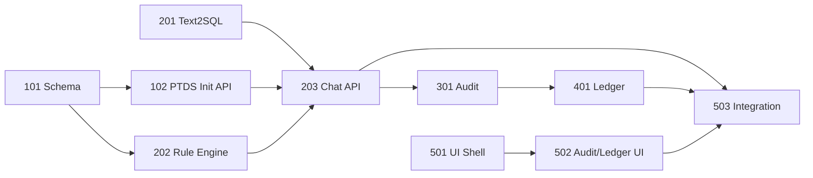

# TrustClaw PTDS — 5-Day Sprint Roadmap

Maps spec tasks to OpenClaw reuse paths. **Decisions D1–D14 approved** (2026-07-04). Task 203 done; next: **301** audit + **501** UI.

**Planning docs:** `PLAN.md` · `DECISIONS.md` · `OPENCLAW_REUSE.md`

## Architecture mapping

| PTDS system | Primary owner path | Strategy |
| --- | --- | --- |
| PTDS SQLite | `trustclaw/ptds/` (new) | Dedicated `local_ptds.db`; reuse Kysely patterns from `src/state/` |
| Agent Runtime pipeline | `trustclaw/runtime/` (new) | Orchestrator; hook LLM via existing provider stack |
| Runtime Audit | `trustclaw/audit/` (new) | JSONL/SQLite append log; mirror `diagnostic_events` shape |
| Evidence Ledger | `trustclaw/ledger/` (new) | SHA-256 chain files under `state/ptds-evidence/` |
| REST API | `extensions/trustclaw-ptds/` + `trustclaw/api/` | Plugin HTTP via `src/gateway/server/plugins-http.ts` (D2 pending) |
| Demo UI | `trustclaw/ui/` (new) | Vite SPA or Control UI panel; prefer isolated demo SPA for speed |
| GLP-1 agent | `trustclaw/agents/glp1/` (new) | Prompts + pipeline stages only |

**Reuse from OpenClaw (do not rebuild)**

- SQLite/Kysely bootstrap: `src/state/openclaw-state-db.ts`, `src/infra/kysely-sync.ts`
- LLM calls: `src/llm/`
- Gateway HTTP hosting: `src/gateway/server-http.ts`, plugin route registration
- Agent run patterns: `src/agents/embedded-agent-runner/run.ts` (reference only for V1)

**Explicitly out of scope (V1)**

- Rebrand all `openclaw` CLI/config identifiers
- Channel plugins (Telegram, Discord, …)
- OpenClaw doctor migrations for PTDS
- Multi-agent intent routing

---

## Day 1 — PTDS foundation (Dev A)

| Task | Deliverable | Acceptance |
| --- | --- | --- |
| **101** SQLite init script | `trustclaw/ptds/schema/v1.1.sql` + seeds | `.db` queryable; NRDL rules + `v_glp1_nrdl_check_snapshot` |
| **102** `POST /api/ptds/init` | `extensions/trustclaw-ptds` plugin routes | **done** |
| **501-start** UI shell | Landing form + table browser stub | Static layout renders in Chrome |

**Exit gate:** init API returns data visible in PTDS browser tables.

---

## Day 2 — Agent pipeline core (Dev B)

| Task | Deliverable | Acceptance |
| --- | --- | --- |
| **201** Text2SQL | Prompt + SELECT validator | "我的BMI是多少" → clean SQL, no markdown |
| **202** Rule engine | Matcher vs `nrdl_payment_rules` + snapshot view | PASS/FAIL matrix JSON |
| **203-start** Chat orchestrator | Pipeline skeleton | Stages callable in sequence with mock LLM |

**Exit gate:** unit tests for SQL guard + rule matrix on fixture biometrics.

---

## Day 3 — End-to-end chat + audit (Dev B + Dev C)

| Task | Deliverable | Acceptance |
| --- | --- | --- |
| **203** `POST /api/agent/chat` | Full Runtime Context response | One chat completes all stages |
| **301** Audit recorder | `Audit.Record` per stage | JSON audit file grows per chat |
| **501** Chat panel | Wired to chat API | User sees answer + loading state |

**Exit gate:** single chat produces audit trail ID in API response.

---

## Day 4 — Evidence ledger + audit UI (Dev C + Dev D)

| Task | Deliverable | Acceptance |
| --- | --- | --- |
| **401** Ledger commit | Hash chain receipts | `previous_hash` links verify locally |
| **502** Audit panel | Timeline from Runtime Context | SQL, JSON, rule matrix expandable |
| **502** Ledger panel | Receipt cards + verify badge | New receipt after each chat |

**Exit gate:** hash integrity check passes for 3 sequential chats.

---

## Day 5 — Integration + demo hardening (All)

| Task | Deliverable | Acceptance |
| --- | --- | --- |
| **503** Full integration | `pnpm trustclaw:dev` (or documented command) | Demo script runs start-to-finish |
| Reset | `POST /api/ptds/reset` or UI button | Clears DB + audit + ledger for re-demo |
| Evidence tags | Chat citations `[Evidence #N]` + hover | Shows DB values and rule refs |
| DoD review | Checklist in `trustclaw/AGENTS.md` | All five DoD items green |

**Exit gate:** presenter can repeat full demo twice without manual file deletion.

---

## Task dependency graph

---

## Risk register

| Risk | Mitigation |
| --- | --- |
| LLM Text2SQL drift | Schema-in-prompt + empty SQL on unknown tables; fail closed via SELECT guard |
| OpenClaw gateway coupling | Keep PTDS routes in `trustclaw/api/` plugin module |
| Scope creep | ROADMAP tasks only; defer Control UI merge to post-V1 |
| Brand/CLI confusion | User-facing docs say TrustClaw; runtime CLI stays `openclaw` until Phase 2 |

---

## Phase 2 (post-demo, not frozen)

- CLI alias `trustclaw` + config namespace
- Register Insurance/Medication agents via pipeline coordinator
- Merge demo dashboard into Control UI
- Intent routing in runtime coordinator
